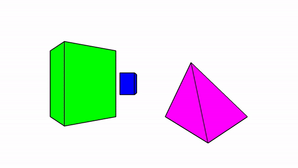

# About

### Problem

- Perform a "dolly zoom", i.e. for several camera positions set the focal length such that the projected 2D height of an object stays constant

### Solution approach

- Given
  - 3D points of objects
  - Desired projected heights h1, h2
- Find
  - Camera position, more exactly its distance to the first object
  - Focal length

