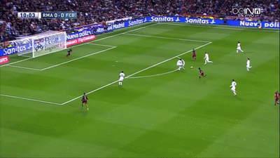

# About

### Problem

- Project a 2D image onto a 2D hyperplane in an image sequence

### Solution approach

- Given
  - 2D image, i.e. Penn Logo
  - 2D pixel coordinates of the four goal corners for each image
- Do
  - Determine homography, which maps 2D logo onto 2D goal (using the four corresponding 2D points)
  - Perform homography
