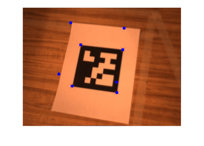

# About

### Problem

- Project a 3D cube into a 2D image sequence ("augmented reality")

### Solution approach

- Given
  - Initial 2D pixel coordinates of four QR Tag corners
  - Camera intrinsics K
- Do
  - Determine the 2D pixel coordinates of the four QR Tag corners for all images using the Kanade-Lucas-Tomasi feature-tracking algorithm (provided by Matlab)
  - Determine the homography which maps the four bottom cube corners onto the four QR Tag corners
  - Extract the camera pose (R,T) from the homography matrix
  - Project 3D cube corner coordinates onto 2D image
  - Overlay the projected 2D cube corners onto the original image
