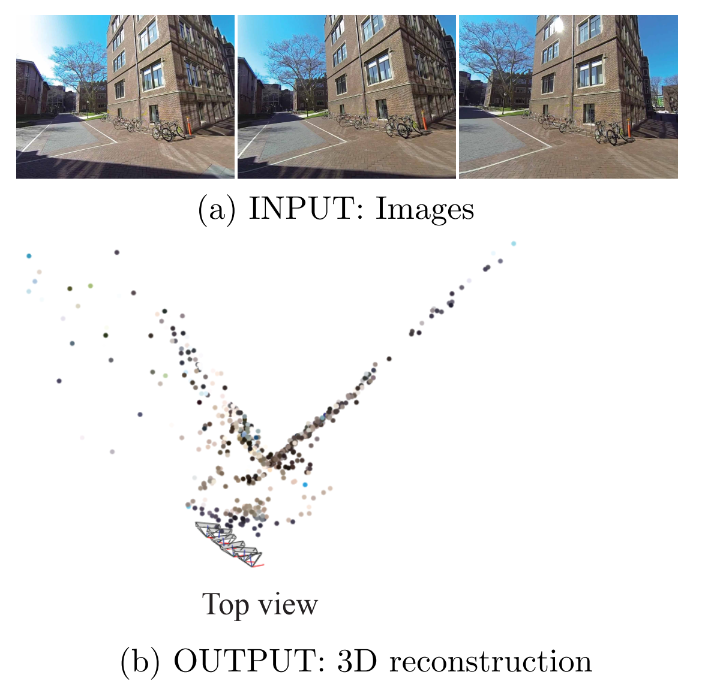

# About

### Problem

- Given three 2D images, estimate the 3D scene

### Solution approach

- Given
  - Corresponding 2D (feature) points in three images
  - Camera intrinsics K
- Do
  - Using the corresponding pixels in two images, determine the fundamental matrix F via `x_2' F x_1 = 0`
  - Determine the essential matrix E via `E = K' * F * K`
  - Determine the 3D coordinates `X` via linear triangulation, i.e. minimize the algebraic error `eps=x_1/2 cross PX` 
  - Estimate the pose (R,t) of the camera in the third image. Therefore, first estimate the camera projection matrix `P_3` using linear least squares ("Perspective-n-Point") via `x_3' cross P_3 X`  and then extract the rotation and translation part from it (given the camera intrinsics).
  - Refine the estimate for the 3D coordinates X using all three camera images via nonlinear triangulation, i.e. minimize the reprojection error `eps=sum(PX-x)^2`
  